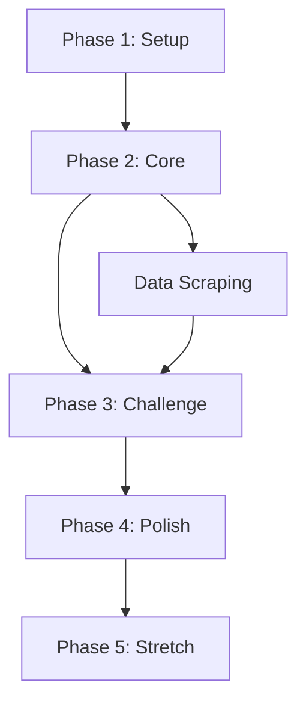

# Implementation Roadmap

## Overview

This document outlines the implementation phases for the DSTS Challenge Runs project. Each phase builds upon the previous, with clear deliverables and acceptance criteria.

## Phase Summary

| Phase | Name | Duration | Priority |
|-------|------|----------|----------|
| 1 | Project Setup | 1-2 days | MVP |
| 2 | Core Infrastructure | 3-5 days | MVP |
| 3 | Random Evolution Challenge | 5-7 days | MVP |
| 4 | Polish & Deploy | 2-3 days | MVP |
| 5 | Stretch Goals | TBD | Future |

---

## Phase 1: Project Setup

### Objective
Initialize the project with proper tooling, configuration, and structure.

### Deliverables

- [ ] **1.1** Initialize Svelte 5 project with Vite
  - SvelteKit setup with static adapter
  - TypeScript configuration
  - Path aliases configured

- [ ] **1.2** Configure UI framework
  - Tailwind CSS setup
  - shadcn-svelte installation
  - Base theme configuration (game-inspired colors)

- [ ] **1.3** Development tooling
  - ESLint + Prettier configuration
  - Vitest setup
  - Husky pre-commit hooks (optional)

- [ ] **1.4** GitHub Actions workflow
  - Build and test on PR
  - Deploy to GitHub Pages on merge to main

- [ ] **1.5** Project documentation
  - Update README with project overview
  - Add CONTRIBUTING.md

### Acceptance Criteria
- `npm run dev` starts development server
- `npm run build` produces static output
- `npm run test` runs test suite
- GitHub Actions workflow passes

---

## Phase 2: Core Infrastructure

### Objective
Build the foundational components, routing, and state management.

### Deliverables

- [ ] **2.1** Layout and routing
  - Root layout with header navigation
  - Landing page (challenge selection)
  - About page
  - Challenge detail page route (`/challenge/[id]`)

- [ ] **2.2** Static data integration
  - Scrape Digimon data (name, stage, image)
  - Scrape boss data (name, level, order)
  - Create JSON files in `src/data/`

- [ ] **2.3** State management
  - App state store
  - Challenge state store
  - LocalStorage persistence utilities

- [ ] **2.4** Randomization service
  - Seeded random number generator
  - Re-roll functionality
  - Duplicate prevention logic

- [ ] **2.5** Common components
  - Header component
  - Card components
  - Button components (using shadcn)

### Acceptance Criteria
- Navigation between pages works
- Digimon and boss data loads correctly
- State persists across page reloads
- Randomizer produces consistent results with same seed

---

## Phase 3: Random Evolution Challenge

### Objective
Implement the first challenge run with full functionality.

### Deliverables

- [ ] **3.1** Challenge configuration
  - Create `random-evolution.json` config
  - Define evolution checkpoints
  - Define rules

- [ ] **3.2** Landing page
  - Challenge card display
  - Challenge description
  - "Start/Continue" button

- [ ] **3.3** Challenge detail page
  - Current team display
  - Boss checkpoint progress
  - Evolution tier indicator
  - Level cap display

- [ ] **3.4** Re-roll functionality
  - Seed input field
  - Re-roll button
  - Re-roll history display
  - New seed generation

- [ ] **3.5** Progress tracking
  - Boss checkpoint advancement
  - Evolution tier upgrades
  - State persistence

- [ ] **3.6** Digimon display
  - Digimon cards with images
  - Stage indicators
  - Team composition view

### Acceptance Criteria
- User can generate random team with seed
- Re-roll works and shows new team
- Progress persists after refresh
- Evolution tier updates at checkpoints
- No duplicate Digimon in team

---

## Phase 4: Polish & Deploy

### Objective
Finalize the MVP with polish, testing, and deployment.

### Deliverables

- [ ] **4.1** UI polish
  - Responsive design for mobile
  - Loading states
  - Error handling
  - Animations/transitions

- [ ] **4.2** Accessibility
  - Keyboard navigation
  - ARIA labels
  - Color contrast compliance

- [ ] **4.3** Testing
  - Unit tests for randomizer
  - Unit tests for state management
  - Component tests for key flows
  - E2E test for main user flow (optional)

- [ ] **4.4** Documentation
  - Complete README
  - Code comments
  - User guide (in-app or wiki)

- [ ] **4.5** Deployment
  - Verify GitHub Pages deployment
  - Test production build
  - Add custom domain (optional)

### Acceptance Criteria
- No console errors in production
- Works on mobile devices
- All tests pass
- Lighthouse score > 90

---

## Phase 5: Stretch Goals (Future)

### Potential Features

- [ ] **5.1** Additional challenge types
  - Nuzlocke-style challenge
  - Type restriction challenge
  - Solo Digimon challenge

- [ ] **5.2** Export/Import functionality
  - Export challenge state as JSON
  - Import saved state

- [ ] **5.3** Shareable URLs
  - Encode seed and settings in URL
  - "Share Run" button

- [ ] **5.4** Advanced statistics
  - Challenge completion tracking
  - Historical runs view

- [ ] **5.5** Enhanced Digimon data
  - Stats display
  - Evolution trees
  - Type advantages

---

## Milestones

| Milestone | Target | Description |
|-----------|--------|-------------|
| M1: Setup Complete | Week 1 | Project initialized, CI/CD working |
| M2: Core Ready | Week 2 | Routing, state, data in place |
| M3: MVP Complete | Week 3-4 | Random Evolution Challenge functional |
| M4: Public Release | Week 4-5 | Deployed to GitHub Pages |

---

## Risk Mitigation

| Risk | Mitigation |
|------|------------|
| Scraped data incomplete | Manual verification, fallback to placeholder data |
| Complex state management | Start simple, iterate based on needs |
| Scope creep | Strict MVP scope, document stretch goals separately |
| Browser compatibility | Test in major browsers early |

---

## Dependencies

## Issue Tracking

Each phase should be tracked as a GitHub milestone with individual issues for deliverables:

- Label `mvp` for Phases 1-4
- Label `stretch` for Phase 5
- Label `blocked` for items with dependencies

## Review Gates

| Gate | Requirement |
|------|-------------|
| Phase 1 → 2 | Dev environment working, CI green |
| Phase 2 → 3 | Core infra tested, data available |
| Phase 3 → 4 | Feature complete, usable |
| Phase 4 → Release | All tests pass, reviewed |
